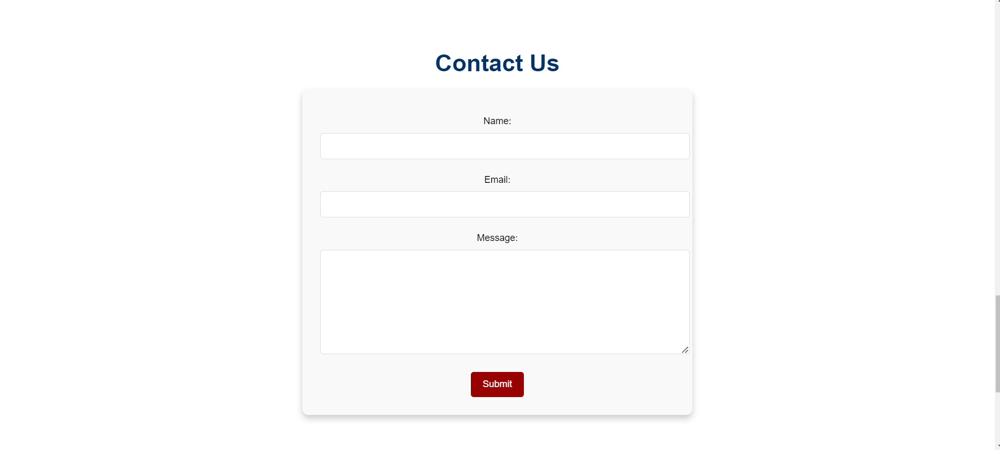

**ALLiance University - Django Application**

**Figma Link**
https://www.figma.com/proto/M1AlXSKIzLpJsQ10RDAiPS/Untitled?node-id=1-2&starting-point-node-id=1%3A2

**Getting Started**
===============

### Dependencies

* Python 3.8+
* Django 3.2+
* Node.js (for JavaScript dependencies)

### Installation

1. Clone the repository:
```bash
git clone [https://github.com/AniketGaurav01/Django-College.git]
```
2. Install Python dependencies:
```bash
pip install -r requirements.txt
```
3. Install Node.js dependencies:
```bash
npm install
```

### Database Setup

1. Run migrations:
```bash
python manage.py makemigrations
```
and 
```bash
python manage.py migrate
```
2. Create a superuser:
```bash
python manage.py createsuperuser
```

### Running the Application

1. Run the development server:
```bash
python manage.py runserver
```
2. Navigate to
```bash
http://localhost:8000
```
in your web browser to access the application.


**Usage**
=====

### Running the Application

1. Navigate to `http://localhost:8000` in your web browser to access the application.
2. Use the navigation menu to access various sections of the application.

### Admin Panel

1. Navigate to ``` http://localhost:8000/admin``` to access the Django admin panel.
2. Log in with your superuser credentials to manage the application's content.

**Screenshots**
==========

**Dashboard**


**About Us & Our Programs Section**


**Admin Panel**


**Contact form**



**footer Section**


**form Response**


**Submission**


**Testimonial**


**Contributing**
==========

### Coding Standards

* Follow the Django coding style guide.
* Use consistent indentation and spacing.

### Submission Procedure

1. Fork the repository and create a new branch for your changes.
2. Make your changes and commit them with a descriptive message.
3. Create a pull request to merge your changes into the main branch.


**Acknowledgments**
==============

* [Owl Carousel](https://owlcarousel2.github.io/OwlCarousel2/) for the hero section carousel.
* [Font Awesome](https://fontawesome.com/) for icons used throughout the application.
